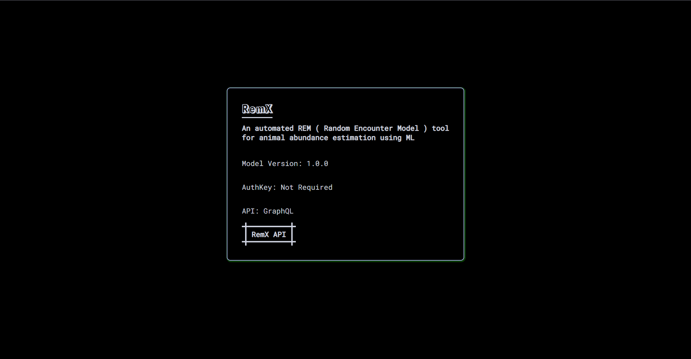

  

    
  

 

[REMX WEBSITE](https://github.com/Adam-Al-Rahman/remx-website) is an automated REM (Random Encounter Model) tool for animal abundance estimation using Machine Learning

  

    
  

<!-- TODO(Adam-Al-Rahman): Add the contributors sections -->

<!-- ## 
Contributors
 -->

<!-- TODO(Adam-Al-Rahman): Add the  References | Citations sections -->

<!-- ## 
References | Citations 
 -->

## 
License

REMX has a MIT-style license, as found in the MIT License file.

- **MIT Licence**: This [OSI-approved](https://opensource.org/licenses/) open-source license is ideal for students and enthusiasts, promoting open collabaration and knowledge sharing. See the [MIT License](https://github.com/Adam-Al-Rahman/remx-website/blob/main/LICENSE) file for more details.

